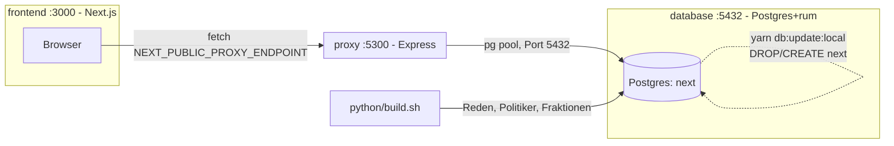
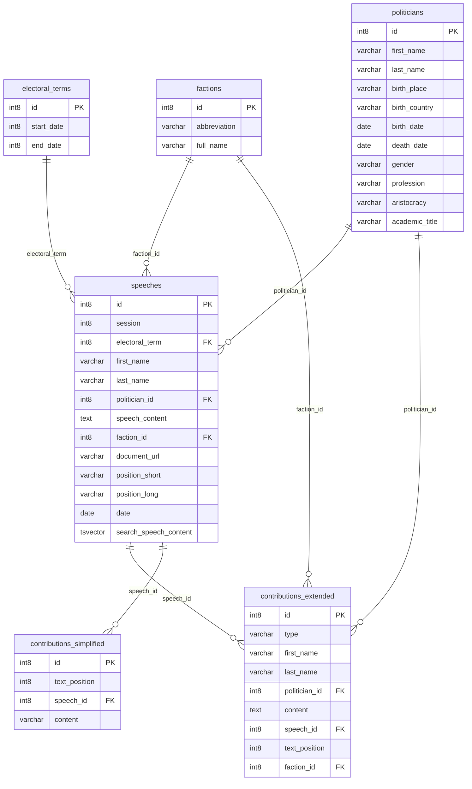

# Architektur

- **frontend**: Next.js, holt Daten client-seitig direkt vom Proxy (kein SSR-Fetch).
- **proxy**: einzige Komponente mit DB-Zugriff, cached GET-Responses, rate-limited.
- **database**: Docker-Image ist nur der leere Postgres-Server; Schema/Daten kommen erst durch `yarn db:update:local` (legt `next` neu an) + `python/build.sh` (Pipeline-Upload).

## Datenmodell

- Schema `open_discourse`, 6 Kerntabellen. `search_speech_content` ist eine generierte `tsvector`-Spalte (German-Volltextsuche), von `search_speeches()` verwendet.
- `speeches.first_name`/`last_name` sind **denormalisiert** (Snapshot des zur Redezeit gebräuchlichen Namens) und können vom `politicians`-Datensatz abweichen — siehe TODO-007.
- Alle FKs mit `politician_id`/`faction_id` sind nullable (`-1`/"not found" als Sentinel bei fehlender Zuordnung, kein `NULL`).
- Weitere Schemas (nicht im Diagramm): `misc` (`fts_tracking`, `topic_tracking` — Such-Query-Logging), `lda_group`/`lda_person` (Topic-Modelling, separat von der Kernsuche).
