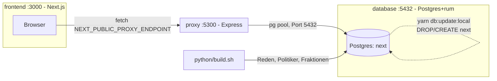

# Architektur

- **frontend**: Next.js, holt Daten client-seitig direkt vom Proxy (kein SSR-Fetch).
- **proxy**: einzige Komponente mit DB-Zugriff, cached GET-Responses, rate-limited.
- **database**: Docker-Image ist nur der leere Postgres-Server; Schema/Daten kommen erst durch `yarn db:update:local` (legt `next` neu an) + `python/build.sh` (Pipeline-Upload).
